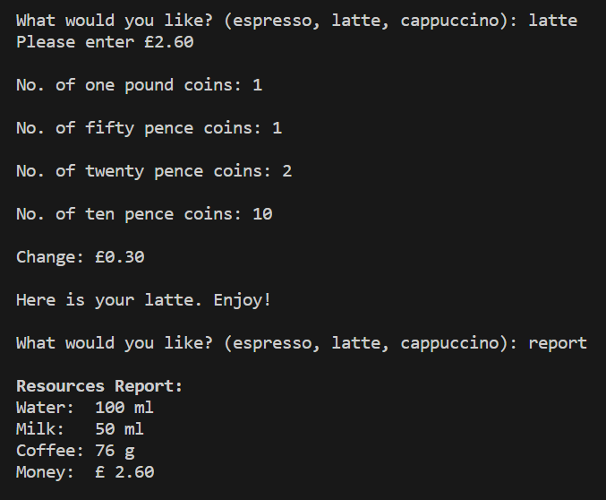

# ☕ Coffee machine simulator

## About this project

This is a coffee machine program that simulates a coffee machine's resource management and cash handling systems.

The project idea and starter dictionaries come from the Udemy course, 100 Days of Code by Angela Yu, but the implementation is my own.

https://www.udemy.com/course/100-days-of-code/

## Download / Installation

The only file required to run this program is main.py

For information on installing Python 3, please see the link below:

https://www.python.org/downloads/

## Instructions for use

The program first asks the user to select a drink.

It checks that there are sufficient resources (water, milk, coffee) to make the selected drink and, if so, displays the price.  If resources are insufficient to make the drink, the user is informed.

It then prompts the user for the number of coins entered of the following denominations:
  * £1
  * 50p
  * 20p
  * 10p

If the cash entered exceeds the price, the amount of change provided is displayed and the drink is served.

Instead of entering the name of a chosen drink, the word **report** can be entered to display details of the remaining resources, including money in the machine.

  Example:

   

## Potential improvements

While this project was created for the purpose of my learning, it could potentially be improved by

* making cash entry more intuitive / providing payment options
* adding a graphical user interface
* expanding the range of drinks available

## Learning

This project was helpful in terms of consolidating my knowledge of:

* functions
* accessing dictionary values
* formatting decimal point display
